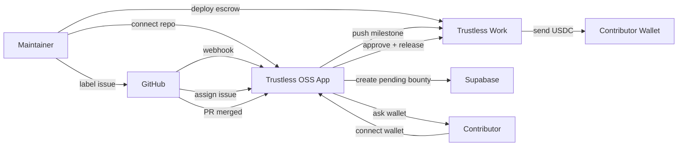

<div align="center">
  <h1>Trustless OSS</h1>
  <p><strong>Live demo:</strong> <a href="https://trustless-oss.vercel.app/">https://trustless-oss-web.vercel.app/</a></p>
</div>

## What this project is

Trustless OSS is a GitHub-integrated bounty platform that turns labeled issues into on-chain USDC payouts.
Maintainers deploy and fund a Trustless Work escrow, and contributors receive funds automatically when a linked PR merges.

## Why it exists

Open source maintainers need a way to pay contributors without manual escrow transfers or trust-based bookkeeping.
This project uses GitHub webhooks, issue labels, and Trustless Work milestones to automate payout execution.

## What it does

- Connects GitHub repos via GitHub App and Supabase auth
- Deploys a Trustless Work multi-release escrow on Stellar
- Marks issues as bounties with `rewarded` + difficulty labels
- Supports `custom` bounties via maintainer comment commands
- Prompts assigned contributors to connect their Stellar wallet
- Creates Trustless Work milestones on assignment
- Releases funds automatically when a PR referencing the issue is merged
- Supports partial payout splits, rejection/dispute, retry, and refund
- Includes a dashboard refund flow to withdraw remaining escrow funds and cancel active bounties

## Live workflow



## Labels and commands

### Supported issue labels

- `rewarded` — marks an issue as bounty-enabled
- `low` / `medium` / `high` — fixed reward tiers
- `custom` — manual amount required via command

### Custom bounty flow

If `custom` is applied, the maintainer must comment:

- `@Trustless-OSS 150`

If the amount is missing, the bot will ask for it.

### Bot commands

#### Maintainer commands

| Command                                        | Purpose                                             |
| ---------------------------------------------- | --------------------------------------------------- |
| `@Trustless-OSS /pay <percentage>`             | Save a partial payout split before merge            |
| `@Trustless-OSS /split <percentage>`           | Alias for `/pay`, set contributor share             |
| `@Trustless-OSS /work <percentage>`            | Alias for `/pay`, set contribution share            |
| `@Trustless-OSS /work-completion <percentage>` | Save a work-completion percentage for split payouts |
| `@Trustless-OSS /reject`                       | Reject the work and refund the escrow               |
| `@Trustless-OSS /rejected`                     | Same as `/reject`                                   |
| `@Trustless-OSS /no`                           | Same as `/reject`, dispute and refund the bounty    |
| `@Trustless-OSS /retry`                        | Retry a failed payout or release transaction        |

#### Contributor commands

| Command                          | Purpose                           |
| -------------------------------- | --------------------------------- |
| `@Trustless-OSS /wallet`         | Request the wallet connect link   |
| `@Trustless-OSS /address`        | Request the wallet connect link   |
| `@Trustless-OSS /connect`        | Request the wallet connect link   |
| `@Trustless-OSS /change-address` | Request a new wallet connect link |

#### General command

| Command                | Purpose                               |
| ---------------------- | ------------------------------------- |
| `@Trustless-OSS /help` | Show available bot commands and usage |

> Note: The project does not use `bonus:50` label in code. The active custom flow is `custom` + `@Trustless-OSS <amount>`.

## Issue linking requirement

For automatic payout, a merged PR must reference the issue in its body using keywords like:

- `closes #123`
- `fixes #123`
- `resolves #123`

This is how the app matches the merged PR to the bounty issue.

## Dispute and refund support

- `@Trustless-OSS /reject` triggers a dispute flow and returns funds to the maintainer
- `@Trustless-OSS /pay <percentage>` saves partial payout intent
- Dashboard supports an escrow refund button to withdraw remaining USDC and cancel active issues
- Refund flow uses Trustless Work dispute/resolve logic to pull remaining funds back to the maintainer's wallet
- This is still a hackathon proof-of-concept: platform signing and maintainer dispute resolution are centralized v1 choices

## Refund funds feature

Maintainers can refund escrow funds from the dashboard when a repo is connected and a wallet is linked.
Refunding withdraws remaining USDC from the on-chain escrow, cancels pending/active issues, and updates the app state.

If the maintainer wallet is not connected, the app asks to connect it before refunding.

## Recommended user flow

1. Maintainer logs in and connects a repo.
2. Deploy the Trustless Work escrow contract from the dashboard.
3. Fund the escrow with USDC.
4. Add `rewarded` + `low|medium|high|custom` to an issue.
5. Assign a contributor.
6. Contributor follows the bot link to connect their Stellar wallet.
7. Submit a PR that references the issue.
8. When the PR merges, the system releases the bounty.

## Project setup (full docs)

### Prerequisites

- Node.js ≥ 20
- pnpm ≥ 10 — [install here](https://pnpm.io/installation)

### Root installation

```bash
# Install all dependencies for both backend and frontend
pnpm install

# Copy environment template
cp .env.example .env

# Fill in your environment variables in .env
```

### Backend setup

```bash
cd apps/backend
pnpm dev
```

Available backend scripts:

- `pnpm dev` — development server with hot reload
- `pnpm build` — compile TypeScript
- `pnpm start` — start compiled server
- `pnpm migrate` — run database migration script
- `pnpm proxy` — webhook proxy helper (for local testing)
- `pnpm lint` — run ESLint
- `pnpm typecheck` — TypeScript type check

### Frontend setup

```bash
cd apps/frontend
pnpm dev
```

Available frontend scripts:

- `pnpm dev` — start Next.js development server
- `pnpm build` — build production app
- `pnpm start` — run production server
- `pnpm lint` — run ESLint
- `pnpm typecheck` — TypeScript type check

### Running from root

```bash
# Run all dev servers in parallel
pnpm dev

# Run individual apps
pnpm dev:backend
pnpm dev:frontend

# Build all apps
pnpm build

# Lint all apps
pnpm lint

# Type check all apps
pnpm typecheck

# Format all code
pnpm format

# Run full validation (typecheck + lint + format check)
pnpm validate
```

### Environment variables

Create a `.env` file at the root by copying the template:

```bash
cp .env.example .env
```

Fill in all required variables. See the `.env.example` file for descriptions of each variable. Key variables include:

- `SUPABASE_URL` / `SUPABASE_SERVICE_ROLE_KEY` — database and auth
- `GITHUB_APP_ID` / `GITHUB_APP_PRIVATE_KEY` / `GITHUB_WEBHOOK_SECRET` — GitHub integration
- `TRUSTLESS_WORK_API_KEY` / `TRUSTLESS_WORK_BASE_URL` — blockchain escrow
- `PLATFORM_STELLAR_SECRET_KEY` / `PLATFORM_STELLAR_PUBLIC_KEY` — Stellar platform wallet
- `NEXT_PUBLIC_SUPABASE_URL` / `NEXT_PUBLIC_SUPABASE_ANON_KEY` — frontend auth
- `NEXT_PUBLIC_BACKEND_URL` — frontend API endpoint

### GitHub App requirements

Required events:

- `issues`
- `issue_comment`
- `pull_request`

Permissions:

- Issues: Read & Write
- Pull requests: Read
- Metadata: Read

### Supabase setup

1. Create a Supabase project
2. Run `docs/schema.sql`
3. Enable GitHub OAuth under Authentication providers

### Key files to inspect

- `backend/src/routes/api.ts` — REST endpoints for repo connect, escrow deploy/fund/refund, and milestone push
- `backend/src/lib/github/webhook.ts` — issue/comment/PR webhook handling and command parsing
- `backend/src/lib/github/labels.ts` — label parsing and reward amount rules
- `backend/src/lib/trustless-work/milestone.ts` — on-chain milestone push and release
- `frontend/app/connect/page.tsx` — contributor wallet onboarding flow
- `frontend/app/dashboard/[repoId]/page.tsx` — repo dashboard and issue state view

## Notes

This repo is a hackathon build with a working live site at the Vercel URL above. It is intended to show automated GitHub issue bounties, but v1 still uses a centralized platform signer and app-level checks for dispute handling.
