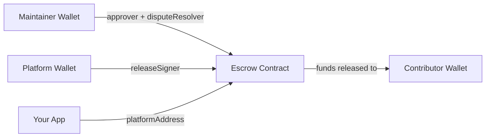
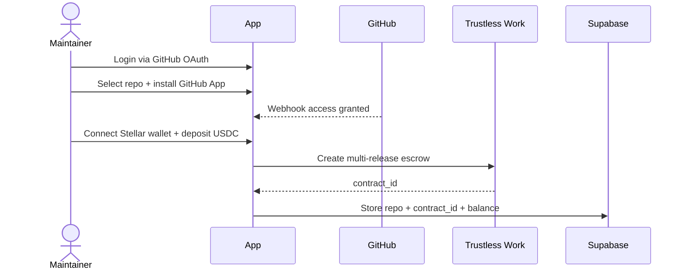
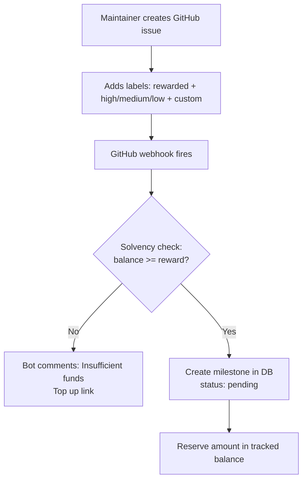
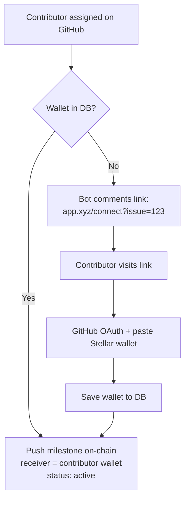
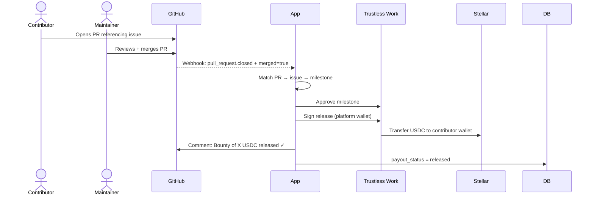

# OSS Bounty — Hackathon Plan
> Trustless, milestone-based rewards for OSS contributors via GitHub + Trustless Work

---

## Product Summary

| Field | Detail |
|---|---|
| **Name** | GitBounty (or pick yours) |
| **Problem** | OSS maintainers can't reliably pay contributors without trust or manual overhead |
| **Parties** | Maintainer (depositor/approver) + Contributor (receiver) |
| **Unlock condition** | PR merged → webhook → auto-approve + release |
| **Dispute resolver** | Maintainer (v1 limitation, acknowledged) |

---

## Tech Stack

| Layer | Tool |
|---|---|
| Frontend | Next.js 14 (App Router) |
| Backend | Next.js API Routes |
| Database | Supabase (PostgreSQL + Auth) |
| Auth | Supabase GitHub OAuth |
| Blockchain | Trustless Work REST API |
| Wallet | Stellar (platform wallet as releaseSigner) |
| Webhooks | GitHub App |

---

## Data Models

### `repos`
```
id, github_repo_id, full_name, owner_github_id,
escrow_contract_id, escrow_balance, created_at
```

### `issues`
```
id, repo_id, github_issue_id, title,
reward_amount, difficulty_label, bonus_amount,
milestone_id (nullable), status (pending|active|completed|cancelled),
created_at
```

### `contributors`
```
id, github_user_id, github_username,
stellar_wallet, created_at
```

### `assignments`
```
id, issue_id, contributor_id,
assigned_at, pr_number, pr_merged_at,
payout_status (pending|released|failed)
```

---

## Role Mapping



---

## Full Flow

### Maintainer Setup



---

### Issue → Milestone (DB only)



---

### Contributor Assignment → On-chain Milestone



---

### PR Merge → Fund Release



---

## Label → Amount Logic

| Label | Base Amount |
|---|---|
| `low` | 25 USDC |
| `medium` | 75 USDC |
| `high` | 150 USDC |
| `custom` | custom amount set by maintainer |

Maintainer can override defaults in repo settings on your platform.

---

## Build Phases

### Day 0 — Pre-Hackathon (May 12, today)
- [ ] Request Trustless Work API key
- [ ] Set up Stellar testnet wallet (platform wallet)
- [ ] Create Supabase project + schema
- [ ] Create Next.js app + Supabase auth
- [ ] Register GitHub App, configure webhook events:
  - `issues.labeled`
  - `issues.assigned`
  - `pull_request.closed`

---

### Day 1 — May 13 (Foundation)
**Goal: Auth + Repo setup + Escrow creation working**

- [ ] GitHub OAuth login (maintainer + contributor)
- [ ] Repo connection UI + GitHub App install flow
- [ ] Trustless Work: create multi-release escrow for repo
- [ ] Fund escrow UI (show balance)
- [ ] Store contract_id in DB

**End of day checkpoint**: Maintainer can log in, connect a repo, and fund an escrow visible in Escrow Viewer.

---

### Day 2 — May 14 (Core Logic)
**Goal: Webhook pipeline + on-chain milestone creation**

- [ ] GitHub webhook receiver (verify signature)
- [ ] Label parser: detect `rewarded`, difficulty, bonus
- [ ] Solvency check + DB milestone creation
- [ ] Contributor OAuth + wallet submission page (`/connect?issue=123`)
- [ ] On-chain milestone push when wallet known
- [ ] PR merge webhook → approve + release flow
- [ ] Platform wallet signing logic

**End of day checkpoint**: Full happy path works end-to-end on testnet.

---

### Day 3 — May 15 (Polish + Demo Prep)
**Goal: UI polish, edge cases, demo script**

- [ ] Maintainer dashboard: repo escrow balance, issues, milestone statuses
- [ ] Contributor dashboard: assigned issues, pending/released bounties
- [ ] Issue comment bot messages
- [ ] Escrow Viewer link per repo (judges will check this)
- [ ] Handle edge cases:
  - PR closed without merge (don't release)
  - Issue unassigned (cancel pending milestone)
  - Escrow underfunded
- [ ] Record demo video

---

## Edge Cases to Handle

| Scenario | Handling |
|---|---|
| PR closed, not merged | Do nothing. Milestone stays active |
| Issue unassigned | Cancel on-chain milestone, return reserved balance |
| Two PRs for same issue | Only merged PR triggers release |
| Contributor never submits wallet | Milestone stays DB-only, funds stay in escrow |
| Escrow underfunded | Block milestone creation, comment on issue |
| Maintainer goes inactive | V1: no timeout. Acknowledge in demo |

---

## Known Limitations (Acknowledge in Demo)

1. **Solvency check is app-level** — not enforced on-chain. Production would move this to contract.
2. **Platform wallet is releaseSigner** — centralization risk. Production needs multisig or oracle.
3. **Maintainer is dispute resolver** — conflict of interest. Production needs neutral third party.
4. **No milestone timeout** — funds can be locked forever if contributor disappears.

---

## Demo Script (for judges)

```
1. Show repo connected + escrow funded (Escrow Viewer)
2. Create GitHub issue + add labels live
3. Show milestone created in your dashboard
4. Assign contributor → show wallet connect flow
5. Show milestone pushed on-chain (Escrow Viewer updates)
6. Merge PR live
7. Show funds released in Escrow Viewer
8. Show contributor dashboard: bounty marked released
```

**Total demo time: ~3 minutes**

---

## Judging Criteria Checklist

| Criteria | Your Answer |
|---|---|
| What trust problem? | Maintainers can't pay contributors without trust |
| Who are the parties? | Maintainer (depositor) + Contributor (receiver) |
| What unlocks funds? | PR merged → webhook → auto-release |
| Who resolves disputes? | Maintainer (v1), acknowledged limitation |
| Live escrow in Viewer? | Yes — show contract_id per repo |
